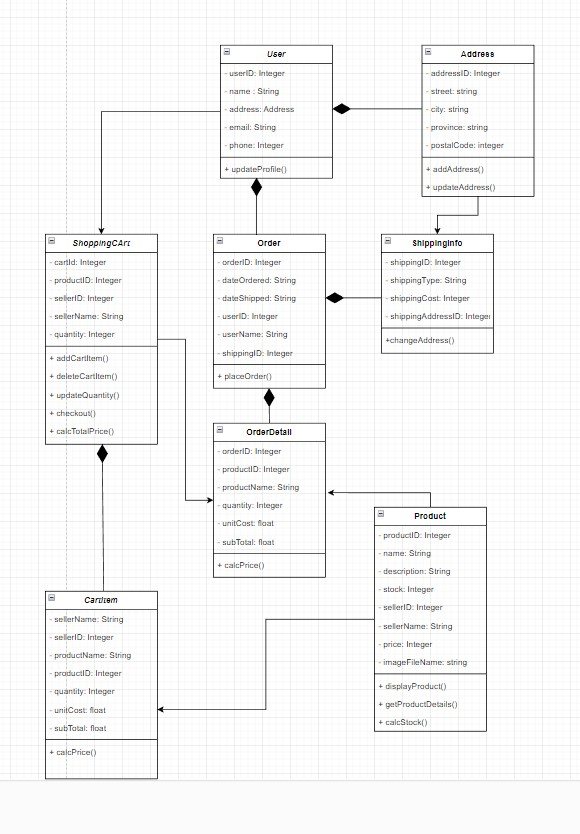
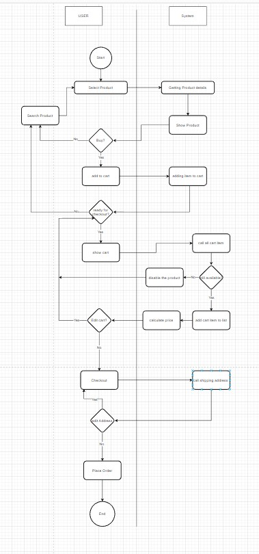

# Tokopedia Create Order System Design

This text was to complete week 6 assignment where the task was to explain how create order system works. To complete this assignment i use tokopedia as reference to give me some visual for how the system works.

All the diagram saved [here](https://drive.google.com/file/d/1Yy7IYvjMPmpx0POv-ICrWVTZwoukZx2A/view?usp=sharing)


After doing brief analysis on the screen-shot I conclude :

## Class Diagram



explanation:

| Class         | Description                                                                                                                                                                                                                                                                                                                             |
| ------------- | --------------------------------------------------------------------------------------------------------------------------------------------------------------------------------------------------------------------------------------------------------------------------------------------------------------------------------------- |
| User          | This class handle all the information about the buyer, they can update their profile including choosing address. The updateProfile() function when user click update profile button.                                                                                                                                                    |
| Address       | This class handle all the information about the user address will use to make transaction. The addAddress() function will add additional address to be used in the transaction. The updateAddress() will save change made in the information of the selected address id                                                                 |
| Product       | This class handle all the product information and stock. The displayProduct() and getProductDetails() are called when the product are clicked. those function are retrieving the image and details of the products to be shown on the product detail page.                                                                              |
| Cart Item     | A CartItem object indicates the quantity, unitcost, subtotal amount of the product selected by the user. When a user performs a product selection and clicks "Add to Cart" button, a new cartItem object is created and added to the cart. The calcPrice() function is called to calculate the total amount of the items added to cart. |
| Shopping Cart | ShoppingCart class has all the products that are added by a user to buy. The addCartItem() and deleteCartItem() methods are called when user performs actions like "Add to Cart" and "Delete" of products. The updateQuantity() method is called when user clicks "+" button on ShoppingCart.                                           |
| Order Details | This Class handles details for every order that the user makes. The calcPrice() method is called to calculate the total amount of the order placed.                                                                                                                                                                                     |
| Shipping Info | This class handles the shipping information regarding every user and their orders. The changeAddress() method is called when user edits the shipping Information and clicks the "pilih alamat lain" button. The changeShippingMethod() is called when the user click "kirim ke beberapa alamat"                                         |
| Order         | This class will store all information regarding the orders made by each user. The placeOrder() method is called when user clicks on the "Bayar" button.                                                                                                                                                                                 |

## Flow Chart



within this flow chart showing how checkout process from product selection.

## Pseudocode

for thi assigment there is requirement for writting the pseudocode for how place order works.

```Javascript

function createOrder()
    get product.productID;
    let ID = product.productID;
    let productDetail = loadDetail.ID
        if (productDetail.stock < 1) {
        productDetail.status = unavailable};
        else {
            priceTotal = buy.quantity * productDetail.price;
            stockLeft = productDetail.stock - buy.quantity;
            productDetail.stock = StockLeft;
            order.price = priceTotal;
        }; return (order)

```

Complexity Analysis
get product.productID --> O(log n)
if productDetail.stock < 1 --> O(1)
priceTotal --> O(nm)
StockLeft --> O(1)
ProductDetail.stock --> O(1)

based on the complexity, the highest complexity is O(log n) so this function wilh have O(log n) complexity
